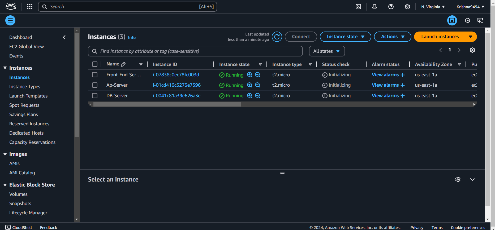
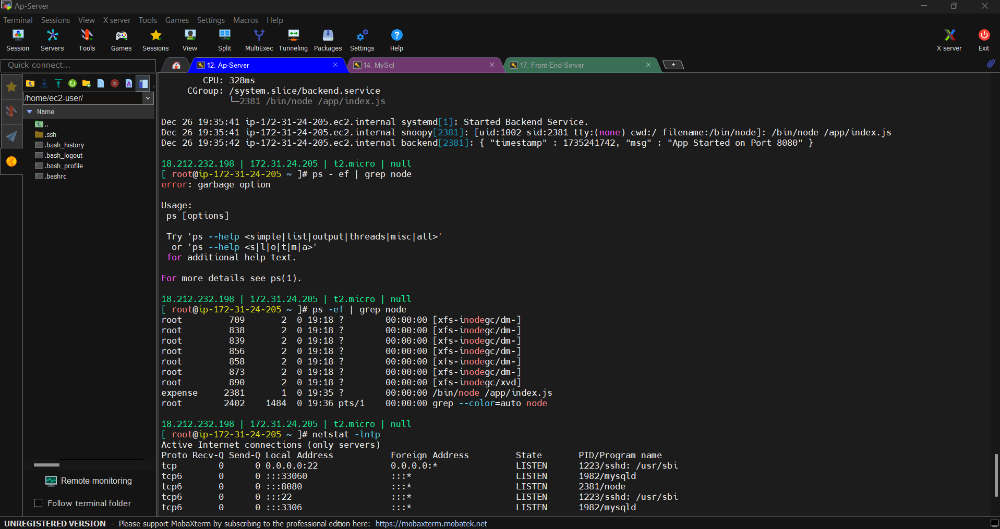
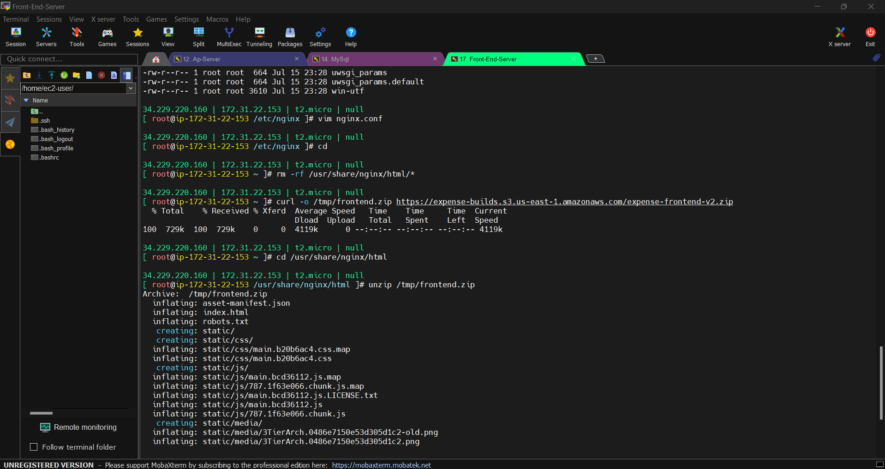
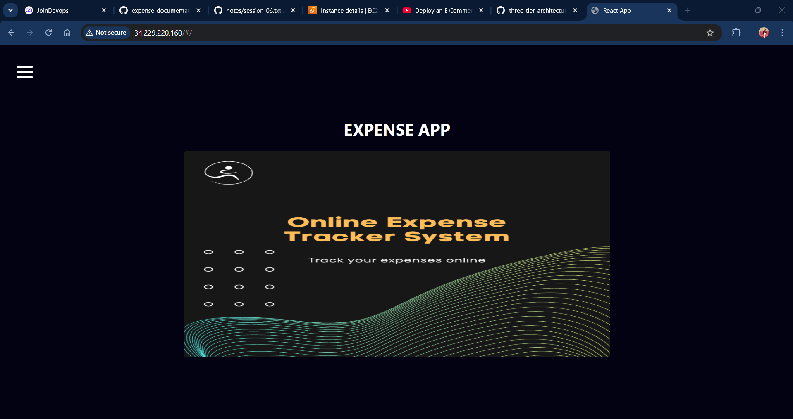
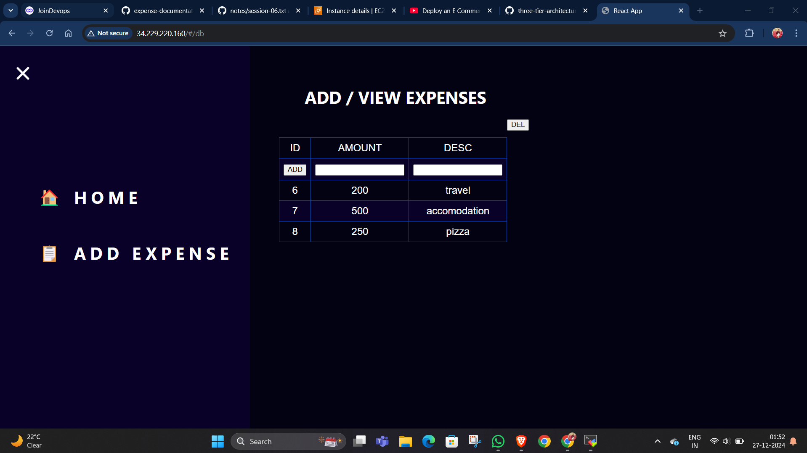

# 💸 Expense Management System - 3-Tier Architecture on AWS

A scalable, secure, and efficient **Expense Management System** designed using a 3-tier architecture, hosted on AWS infrastructure to ensure high availability and fault tolerance.

---

## 🌟 Features
- **3-Tier Architecture**:
  - **Presentation Tier**: A React.js front-end hosted on Amazon S3 with CloudFront for global content delivery.
  - **Application Tier**: Node.js application deployed on EC2 instances with Auto Scaling and Load Balancing.
  - **Database Tier**: Amazon RDS (MySQL) with Multi-AZ deployment for high availability.

- **Secure & Scalable**:
  - Implemented Virtual Private Cloud (VPC) for enhanced security.
  - Integrated Auto Scaling for traffic management and fault tolerance.

- **Monitoring & Insights**:
  - Real-time monitoring and metrics using Amazon CloudWatch.

---

## 🏗️ Architecture Overview

### **1. Presentation Tier**
- **Technology**: React.js
- **Hosting**: Amazon S3 with CloudFront for global content delivery.
- **Role**: Displays the user interface for expense tracking.

### **2. Application Tier**
- **Technology**: Node.js
- **Hosting**: Amazon EC2 instances deployed in an Auto Scaling Group behind an Application Load Balancer.
- **Role**: Processes business logic, manages API endpoints, and communicates with the database.

### **3. Database Tier**
- **Technology**: MySQL
- **Hosting**: Amazon RDS with Multi-AZ deployment for high availability and fault tolerance.
- **Role**: Stores and retrieves expense records securely.

---

## 🔒 AWS Instances

This project utilizes the following AWS EC2 instances to implement the 3-tier architecture:

### **Instance Details**
| Instance Name    | Instance ID       | Instance Type | State    | Availability Zone |
|------------------|-------------------|---------------|----------|-------------------|
| Front-End-Server | i-07838c0ec78fc003d | t2.micro      | Running  | us-east-1a        |
| Application Server (Ap-Server) | i-01cd416c5273e7396 | t2.micro      | Running  | us-east-1a        |
| Database Server (DB-Server) | i-0041c81a39e626a3e | t2.micro      | Running  | us-east-1a        |

### Screenshot of AWS EC2 Dashboard

---

## 🎨 Key Contributions
- **Scalability**:
  - Designed Auto Scaling policies to handle increased application traffic dynamically.
- **Security**:
  - Configured VPC for secure communication between tiers.
  - Implemented security groups and NACLs for restricted access.
- **Performance Optimization**:
  - Optimized front-end performance using React.js.
  - Leveraged caching with CloudFront for faster delivery of assets.
- **Monitoring**:
  - Set up CloudWatch alarms to monitor system health and notify during downtimes.

---

## 📸 Screenshots

### Backend Server Configuration

### Frontend Server Configuration

### Expense Management Interface - Homepage

### Expense Management Interface - Add Expense

---

## 🚀 Technologies Used
- **AWS Services**:
  - Amazon EC2 (Application Tier)
  - Amazon RDS (Database Tier)
  - Amazon S3 & CloudFront (Presentation Tier)
  - Amazon CloudWatch (Monitoring)
  - Amazon VPC (Networking)
- **Front-End**: React.js
- **Back-End**: Node.js
- **Database**: MySQL

---

## 💡 Project Objectives
1. To implement a robust 3-tier architecture on AWS for scalability and fault tolerance.
2. To ensure high availability of the system using Multi-AZ and Load Balancing.
3. To deliver an interactive and user-friendly expense tracking interface.

---
